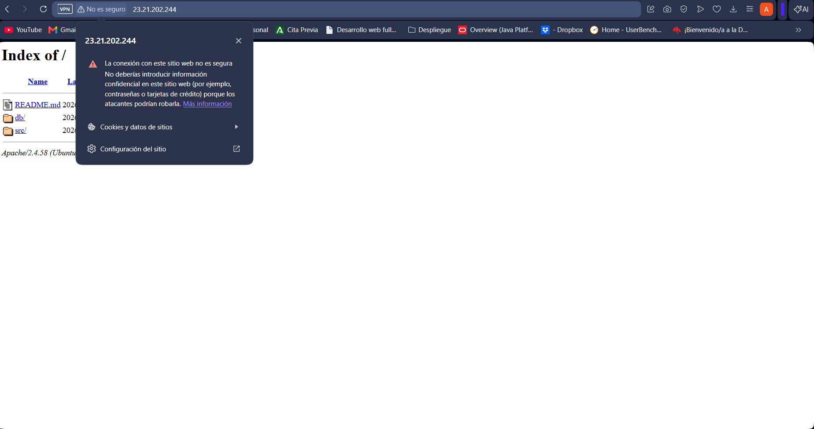

### ¿Qué es SSL/HTTPS?

**SSL (Secure Sockets Layer)** y su sucesor **TLS (Transport Layer Security)** son protocolos que cifran la conexión entre el navegador y el servidor, protegiendo datos sensibles como credenciales, información personal, etc.

**HTTPS** es HTTP sobre SSL/TLS. En lugar del puerto 80 (HTTP), usa el puerto 443 (HTTPS).

### ¿Qué son los certificados autofirmados?

Un certificado autofirmado es un certificado que generas tú mismo, sin autoridad certificadora externa. Es útil para desarrollo y testing, pero en producción se recomienda un certificado de autoridad certificadora reconocida.

### Nuevo Script: setup_selfsigned_certificate.sh

He creado un nuevo script que automatiza completamente la configuración de HTTPS.

#### Comando:
```bash
cd scripts
sudo bash setup_selfsigned_certificate.sh
```

#### ¿Qué hace este script paso a paso?

**1. Generar el certificado autofirmado**
```bash
openssl req \
  -x509 \
  -nodes \
  -days 365 \
  -newkey rsa:2048 \
  -keyout /etc/ssl/private/apache-selfsigned.key \
  -out /etc/ssl/certs/apache-selfsigned.crt \
  -subj "/C=$OPENSSL_COUNTRY/ST=$OPENSSL_PROVINCE/L=$OPENSSL_LOCALITY/O=$OPENSSL_ORGANIZATION/OU=$OPENSSL_ORGUNIT/CN=$OPENSSL_COMMON_NAME/emailAddress=$OPENSSL_EMAIL"
```

**Desglose de parámetros:**
- `-x509`: Genera un certificado X.509 (estándar SSL/TLS)
- `-nodes`: No cifra la clave privada (necesario para automatización)
- `-days 365`: Validez de 365 días (1 año)
- `-newkey rsa:2048`: Genera clave RSA de 2048 bits (seguridad estándar)
- `-keyout`: Ruta donde guardar la clave privada
- `-out`: Ruta donde guardar el certificado
- `-subj`: Datos del certificado sin interacción (desde variables del `.env`)

**Archivos generados:**
- `/etc/ssl/private/apache-selfsigned.key` - Clave privada (¡CONFIDENCIAL!)
- `/etc/ssl/certs/apache-selfsigned.crt` - Certificado público

**2. Copiar configuraciones de Apache**
```bash
cp ../conf/default-ssl.conf /etc/apache2/sites-available/default-ssl.conf
cp ../conf/000-default.conf /etc/apache2/sites-available/000-default.conf
```
- Instala la configuración HTTPS en Apache
- Mantiene también la configuración HTTP (puerto 80)

**3. Habilitar el sitio SSL**
```bash
a2ensite default-ssl.conf
```
- Activa el VirtualHost HTTPS en Apache

**4. Habilitar módulos necesarios**
```bash
a2enmod ssl
a2enmod rewrite
```
- `ssl`: Módulo SSL/TLS para Apache
- `rewrite`: Permite reescrituras de URL (usado para redirigir HTTP → HTTPS)

**5. Reiniciar Apache**
```bash
systemctl restart apache2
```
- Aplica todos los cambios de configuración

---

### Nueva Configuración: default-ssl.conf

```apache
<VirtualHost *:443>
    DocumentRoot /var/www/html
    DirectoryIndex index.php index.html

    SSLEngine on
    SSLCertificateFile /etc/ssl/certs/apache-selfsigned.crt
    SSLCertificateKeyFile /etc/ssl/private/apache-selfsigned.key

    <Directory /var/www/html>
        Options Indexes FollowSymLinks
        AllowOverride All
        Require all granted
    </Directory>
</VirtualHost>
```

**Explicación:**
- `<VirtualHost *:443>`: Escucha en puerto 443 (HTTPS estándar)
- `SSLEngine on`: Activa SSL/TLS en este VirtualHost
- `SSLCertificateFile`: Ruta del certificado público
- `SSLCertificateKeyFile`: Ruta de la clave privada
- El resto es igual a la configuración HTTP

---

### Variables de Entorno para OpenSSL

Añade estas variables al archivo `.env` en la carpeta `scripts/`:

```bash
# Variables para el certificado SSL/TLS
OPENSSL_COUNTRY="ES"                                    # País (código ISO 2 letras)
OPENSSL_PROVINCE="Madrid"                               # Provincia/Estado
OPENSSL_LOCALITY="Madrid"                               # Localidad/Ciudad
OPENSSL_ORGANIZATION="Mi Empresa"                       # Nombre de la organización
OPENSSL_ORGUNIT="IT Department"                         # Departamento
OPENSSL_COMMON_NAME="mi-servidor.com"                   # Nombre del servidor (dominio)
OPENSSL_EMAIL="admin@mi-servidor.com"                   # Email del administrador
```

**Importante:** El `OPENSSL_COMMON_NAME` debe coincidir con el dominio o IP de tu servidor.

---

### Tabla de Variables SSL/TLS

| Variable | Significado | Ejemplo |
|----------|-----------|---------|
| `OPENSSL_COUNTRY` | País (código ISO 2 letras) | `ES`, `US`, `MX` |
| `OPENSSL_PROVINCE` | Provincia/Región | `Madrid`, `California` |
| `OPENSSL_LOCALITY` | Ciudad | `Madrid`, `San Francisco` |
| `OPENSSL_ORGANIZATION` | Nombre empresa/organización | `Mi Empresa S.L.` |
| `OPENSSL_ORGUNIT` | Departamento/Unidad | `IT`, `DevOps` |
| `OPENSSL_COMMON_NAME` | **Dominio o IP del servidor** | `www.ejemplo.com`, `192.168.1.1` |
| `OPENSSL_EMAIL` | Email del administrador | `admin@ejemplo.com` |

---

### Verificar que HTTPS está funcionando

Después de ejecutar el script:

1. **Verificar que Apache reinició correctamente**
   ```bash
   systemctl status apache2
   ```

2. **Acceder a través de HTTPS**
   ```bash
   curl -k https://localhost
   # O en navegador: https://tu-servidor-ip
   # Nota: -k ignora la advertencia de certificado no confiable (autofirmado)
   ```

3. **Ver certificado en el navegador**
   
   - Se mostrará una advertencia de seguridad (es normal con certificados autofirmados)
   - El navegador permite continuar sin riesgos reales

4. **Verificar que los puertos están escuchando**
   ```bash
   netstat -tlnp | grep apache2
   # Debe mostrar escucha en 0.0.0.0:80 y 0.0.0.0:443
   ```

---

### Redirigir HTTP → HTTPS (Opcional)

Si quieres forzar que todo tráfico vaya por HTTPS, modifica `000-default.conf`:

```apache
<VirtualHost *:80>
    ServerName tu-dominio.com
    
    # Redirigir todo HTTP a HTTPS
    RewriteEngine On
    RewriteCond %{HTTPS} off
    RewriteRule ^(.*)$ https://%{HTTP_HOST}%{REQUEST_URI} [L,R=301]
</VirtualHost>
```

Luego reinicia Apache:
```bash
systemctl restart apache2
```

---

### Orden de ejecución recomendado

Para un despliegue completo con HTTPS:

1. **Instalar LAMP** (si no está instalado)
   ```bash
   bash install_lamp.sh
   ```

2. **Desplegar la aplicación**
   ```bash
   bash deploy.sh
   ```

3. **Configurar certificados SSL/HTTPS**
   ```bash
   sudo bash setup_selfsigned_certificate.sh
   ```

---

### Problemas comunes con SSL

**Error: "Certificate verification failed"**
- Es normal con certificados autofirmados
- En curl usa: `curl -k https://localhost`
- En navegador: haz clic en "Continuar" o "Aceptar riesgo"

**Error: "SSL_ERROR_RX_RECORD_TOO_LONG"**
- El navegador está accediendo a HTTP en el puerto 443
- Asegúrate de usar `https://` (no `http://`)

**Error: "Permission denied" al ejecutar el script**
```bash
chmod +x scripts/setup_selfsigned_certificate.sh
sudo bash scripts/setup_selfsigned_certificate.sh
```

**Los módulos SSL no se cargan**
```bash
sudo a2enmod ssl
sudo a2enmod rewrite
sudo systemctl restart apache2
```

---

## Solución de Problemas Comunes

### Los scripts no tienen permisos de ejecución
```bash
chmod +x scripts/install_lamp.sh
chmod +x scripts/deploy.sh
```

### Permiso denegado al ejecutar scripts
```bash
sudo bash scripts/install_lamp.sh
sudo bash scripts/deploy.sh
```

### Error: "No such file or directory" para `.env`
- Verifica que el archivo `.env` existe en la carpeta `scripts/`
- Ejecuta los scripts desde la carpeta `scripts/`

### MySQL rechaza la contraseña
- Verifica que `DB_ROOT_PASS` en `.env` coincide con la contraseña que estableciste
- Si es la primera ejecución, MySQL puede estar sin contraseña

### La aplicación muestra errores de conexión a BD
- Verifica que la BD, usuario y contraseña en `config.php` son correctos
- Ejecuta: `mysql -u root -p"$DB_ROOT_PASS" -e "USE $DB_NAME; SHOW TABLES;"`

---

## Notas de Seguridad

1. **Cambia las contraseñas por defecto** en el archivo `.env`
2. **No commits `.env`** al repositorio (agrega a `.gitignore`)
3. **Usa HTTPS en producción** (certificado SSL/TLS)
   - Este proyecto usa **certificados autofirmados** (útil para desarrollo)
   - En producción, usa certificados de autoridades certificadoras reconocidas (Let's Encrypt, etc.)
4. **Protege la clave privada** (`/etc/ssl/private/apache-selfsigned.key`)
   - Nunca compartas ni subas a repositorios
   - Usa permisos restrictivos: `chmod 600`
5. **Restringe permisos de archivos** sensibles
6. **Actualiza regularmente** los paquetes del sistema
   ```bash
   sudo apt-get update && sudo apt-get upgrade -y
   ```
7. **Monitora los logs** regularmente
   ```bash
   tail -f /var/log/apache2/error.log
   tail -f /var/log/apache2/access.log
   ```

---

## Variables de Entorno (.env)

### Variables de Base de Datos

| Variable | Descripción | Ejemplo |
|----------|-------------|---------|
| `DB_ROOT_PASS` | Contraseña root de MySQL | `SecurePass123!` |
| `DB_NAME` | Nombre de la base de datos | `mi_aplicacion` |
| `DB_USER` | Usuario para la aplicación | `app_user` |
| `DB_PASS` | Contraseña del usuario | `AppPass456!` |
| `REPO_URL` | URL del repositorio Git | `https://github.com/user/repo.git` |
| `DIR_TEMP` | Directorio temporal | `/tmp/app-temp` |

### Variables de Certificado SSL/TLS [NUEVO]

| Variable | Descripción | Ejemplo |
|----------|-------------|---------|
| `OPENSSL_COUNTRY` | País (código ISO 2 letras) | `ES`, `US`, `MX` |
| `OPENSSL_PROVINCE` | Provincia/Región | `Madrid`, `California` |
| `OPENSSL_LOCALITY` | Ciudad | `Madrid`, `San Francisco` |
| `OPENSSL_ORGANIZATION` | Nombre empresa/organización | `Mi Empresa S.L.` |
| `OPENSSL_ORGUNIT` | Departamento/Unidad | `IT`, `DevOps` |
| `OPENSSL_COMMON_NAME` | **Dominio o IP del servidor** | `www.ejemplo.com`, `192.168.1.1` |
| `OPENSSL_EMAIL` | Email del administrador | `admin@ejemplo.com` |

---

## Referencias Útiles

- [Documentación Apache](https://httpd.apache.org/docs/)
- [Documentación Apache - SSL/TLS](https://httpd.apache.org/docs/current/ssl/)
- [Documentación OpenSSL](https://www.openssl.org/docs/)
- [Documentación MySQL](https://dev.mysql.com/doc/)
- [Documentación PHP](https://www.php.net/docs.php)
- [Bash scripting guide](https://www.gnu.org/software/bash/manual/)
- [Let's Encrypt (certificados gratuitos para producción)](https://letsencrypt.org/)
- [Mozilla SSL Configuration Generator](https://ssl-config.mozilla.org/)

---

## Contacto y Soporte

Para problemas o preguntas sobre este despliegue, contacta al administrador del sistema.